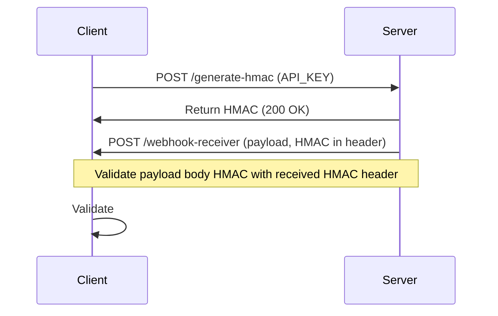

# HMAC Webhooks Example

This repository contains examples of generating and verifying HMAC signatures to secure webhooks.



It uses [Vitest](https://vitest.dev/) for testing and [Supertest](https://github.com/visionmedia/supertest) to simulate HTTP requests.

## Getting Started

Install using bun

```bash
bun install
```

## Run the tests

```bash
bun test
```
